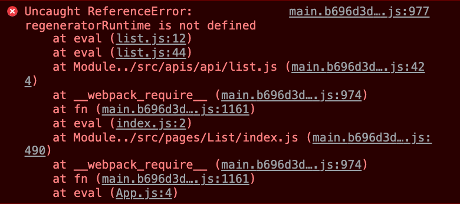

# 바벨 regenerator 오류

## 문제

axios와 async await를 쓰고, dev-server를 구동하니 에러 발생


<br>

## 원인

폴리필을 제대로 해주지 않았다.

전 babelrc

```json
{
  "presets": ["@babel/preset-env", "@babel/preset-react"]
}
```

<br>

## 해결

폴리필을 위해 `core-js@3`을 설치한 후 babelrc 수정

```json
{
  "presets": [
    [
      "@babel/preset-env",
      {
        "targets": "> 0.25%, not dead",
        "useBuiltIns": "usage",
        "modules": "cjs",
        "corejs": 3
      }
    ],
    ["@babel/preset-react"]
  ]
}
```

1. target: 얼마나 오래된 브라우저를 지원할것인가.
2. useBuiltIns: corejs를 전역으로 받아서 폴리필 할것인가 `entry`, 쓰는함수들만 쏙쏙 빼서 폴리필 해줄것인가 `usage`
3. modules: esm과 cjs를 같이 쓸수 있도록 'cjs'로 설정해준다.  
   노드 모듈스에서 바벨을 적용한 라이브러리에서 cjs로 익스포트 했는데 가져올때 esm으로 가져와서 발생했던 문제 해결
4. corejs: core-js 버전 명시

<br>

### 참고사항

처음 검색했을땐, `@babel/plugin-transform-runtime`을 통해 해결할수 있다고 보았는데, 이또한 core-js를 적용할 수 있는 방법이었다. 다만 [ 인스턴스 메소드는 적용이 불가하며, 이를 위해선 preset-env를 쓰라고 공식 문서에서 안내하고 있음.](https://babeljs.io/docs/en/babel-plugin-transform-runtime)

<br>

참고한 곳

https://babeljs.io/docs/en/babel-preset-env
https://tech.kakao.com/2020/12/01/frontend-growth-02/
https://velog.io/@vnthf/corejs3%EB%A1%9C-%EB%8C%80%EC%B2%B4%ED%95%98%EC%9E%90-zok3p9aouy
