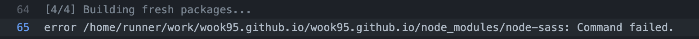

# 갯츠비 블로그의 github action 오류

## 문제

나는 gatsby-starter-bee 템플릿으로 블로그를 만들고,
지금까지 github action을 통해 푸쉬만 잘 하면 배포가 되도록 main.yml을 구성해 놓았었다.  
이 전까지는 잘 되었는데 , 갑자기 yarn install에서 에러가 났다. 배포가 되지 않았다.

## 원인

오류 메세지를 찾아보니 node-sass 패키지와 관련되어 있었다.

node-sass는 노드 버전에 민감하기 때문에 자주 봤던 문제라 노드 버전의 문제라고 생각했다.

## 해결

노드 버전을 github action에서 정의 해줘야 할것 같아서 알아봤다.
깃헙 공식 문서에서는, setup-node를 통해 정의해주면 된다고 한다.

```
  - uses: actions/setup-node@v2
    with:
      node-version: '14'
```

위와 같이 설정하면 끝 !

```yml
name: build gatsby

on:
  push:
    branches:
      - gh-pages

jobs:
  build_gatsby:
    name: build
    runs-on: ubuntu-latest

    steps:
      - name: checkout code
        uses: actions/checkout@v2

      - uses: actions/setup-node@v2
        with:
          node-version: '14'

      - name: yarn install
        run: yarn install

      - name: gatsby build
        env:
          GH_API_KEY: ${{ secrets.GITHUB }}
        run: yarn build

      - name: deploy
        uses: maxheld83/ghpages@v0.2.1
          env:
          GITHUB_TOKEN: ${{ secrets.DEPLOY_AUTOMATION_TOKEN }}
          GH_PAT: ${{ secrets.DEPLOY_AUTOMATION }}
          BUILD_DIR: 'public/'
```

출처

1. [깃헙 공식문서](https://docs.github.com/en/actions/automating-builds-and-tests/building-and-testing-nodejs-or-python)

2. [셋업 노드 패키지](https://github.com/actions/setup-node/)
